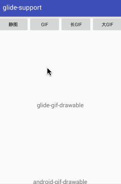
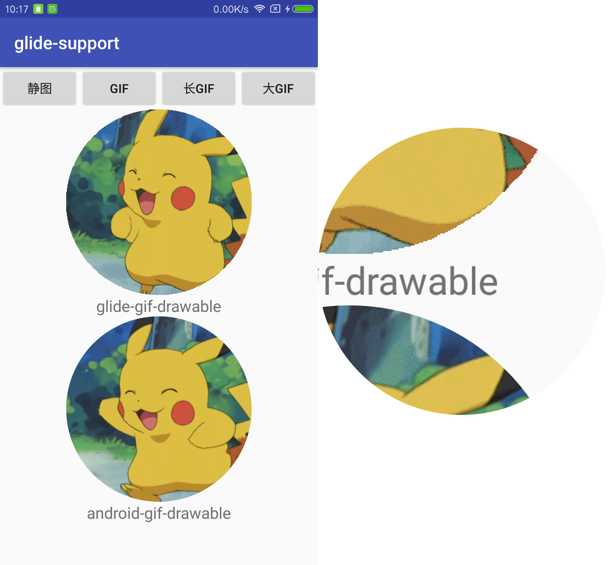

# glide-support
基于[glide](https://github.com/bumptech/glide)与
[android-gif-drawable](https://github.com/koral--/android-gif-drawable)对Glide处理Gif进行加强

## __效果__


## __对比图__


## __示例apk__


## __快速开始__
####  Gradle
```
compile 'com.dyhdyh.support:glide:1.0.0'
```

#### 示例
```
GlideSupport.with(this)
                .gifEnhancement()//开启gif增强
                .circle()//圆形
                //.crossFade()//淡入淡出(默认开启)
                //.transform(new ImageWrapperCircleTransformation())
                //.animate(new DrawableScaleBounceAnimator())
                .glide()
                .load(url)
                .placeholder(R.mipmap.placeholder)
                .error(R.mipmap.error)
                .into(iv);
```
